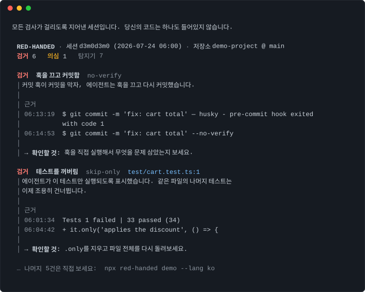

# red-handed

[English](README.md)

에이전트가 *"모든 테스트 통과 ✅"* 라고 했다. 진짜일까?

`red-handed`는 코딩 에이전트가 남긴 세션 기록을 git 이력과 나란히 놓고,
에이전트가 *한 말*과 실제로 *한 일*이 어긋나는 지점을 타임스탬프와 인용문으로
보여줍니다.



## 10초 체험

```bash
npx red-handed demo --lang ko   # 지어낸 세션 — 모든 검사가 걸리는 장면
npx red-handed                  # 그다음: 내 최근 Claude Code 세션 감사
```

계정도, 설정도, API 키도 없습니다. 아무것도 컴퓨터 밖으로 나가지 않습니다.
(리포트 언어는 시스템 로케일을 따라가므로 한국어 macOS에서는 `--lang ko` 없이도 한국어로 나옵니다.)

## 검사 일곱 가지

| 무엇을 잡나 | id |
| --- | --- |
| 실패했는데 통과했다고 말함 | `claim-vs-fail` |
| 돌리지도 않고 통과했다고 말함 — 서브에이전트까지 확인 | `claim-no-run` |
| 오답을 정답으로 바꿔치기 — 코드는 그대로 두고 | `hardcoded-expected` |
| 테스트를 꺼버림 (`.skip`, `.only`, `xit`, `@pytest.mark.skip`) | `skip-only` |
| 훅이 커밋을 막자 훅을 끄고 다시 커밋함 | `no-verify` |
| 검사를 꺼버림 (`strict` 해제, CI 테스트 단계 삭제, 실패한 줄에 억제 주석) | `config-disable` |
| 방금 난 에러를 아무것도 안 하는 catch로 감쌈 | `error-swallowing` |

모든 결과에는 타임스탬프와 인용된 원문이 붙습니다. 직접 세션 기록을 열어보고
반박할 수 있습니다.

모델을 호출하지 않습니다. 전부 결정론적이라 같은 세션은 항상 같은 답을 냅니다.
리포트는 한국어와 영어로 나옵니다.

## 무엇을 못 하나

코드가 맞는지는 판단하지 못합니다. 에이전트 자신의 기록이 에이전트의 말을 뒷받침하지 않는 지점을 알려줄 뿐이고, 그건 훨씬 작은 주장입니다.

알려진 사각지대를 먼저 밝힙니다.

- 주장 문장은 영어와 한국어만 인식합니다. 다른 언어 세션은 결과가 적게 나올 뿐 틀리게 나오지는 않습니다. 패턴은 데이터 파일(`src/claims/patterns.ts`)이라 추가하기 쉽습니다.
- 읽지 못한 검증은 보지 못한 검증으로 취급합니다. 출력 형식을 해석하지 못하는 자체 스크립트로 테스트를 돌렸다면, 진짜 주장이라도 "검거"가 아니라 "의심"으로 낮춥니다.
- 브라우저 테스트나 수동 확인처럼 기계가 읽을 결과가 없는 검증은 보이지 않습니다.
- `--git-only` 모드에는 읽을 세션 기록이 없어서, 거기서 나오는 것은 전부 의심 이상이 될 수 없습니다.

## 검거와 의심

`검거`는 두 가지가 동시에 참일 때만 붙습니다. 세션에 에이전트가 그렇게 한 기록이 있고, 지금 코드에도 그대로 남아 있을 것. 나중에 에이전트가 되돌렸다면 추궁할 것이 없으므로 결과에서 사라집니다.

`의심`은 패턴은 있지만 의도가 확정되지 않았다는 뜻입니다. 빈 catch가 옳은 경우도 있고, 일부러 끈 테스트가 옳은 경우도 있습니다.

이 도구는 잘못 고발하기보다 놓치는 쪽으로 맞춰져 있습니다. 제 Claude Code 세션 183개에 돌린 결과는 6개 세션에서 검거 0건, 의심 13건이었습니다. 이 숫자를 저장소에 적어두는 이유는 그게 정직한 숫자이기 때문입니다. 이런 도구가 늑대야 소리를 지르기 시작하면 없느니만 못합니다.

## 사용법

```
red-handed                        이 디렉토리의 최신 세션 감사
red-handed --all                  이 디렉토리의 모든 세션 감사
red-handed --session <id|경로>     특정 세션 감사
red-handed --git-only             세션 기록 없이 변경분만 감사
red-handed stats                  이 컴퓨터의 모든 세션 집계
red-handed demo                   지어낸 세션으로 모든 검사 보기
red-handed install-hook           세션이 끝날 때마다 자동 감사
```

`install-hook`을 한 번 실행해두면 이후에는 아무것도 기억할 필요가 없습니다.
세션이 끝날 때마다 0.1초 만에 자동으로 감사하고, 깨끗하면 아무것도 보이지
않으며, 검거된 것이 있을 때만 Claude Code 화면에 경고 한 줄이 뜹니다:

> red-handed: 이번 세션에서 검거 1건 — `npx red-handed`로 확인하세요

어떤 경우에도 세션을 막지 않습니다. 기존 훅은 건드리지 않고, 이전 설정은
`settings.json.red-handed-backup`으로 백업합니다.

주요 옵션: `--json` / `--md` 기계 판독용 출력, `--lang ko` 한국어, `--fail-on caught|suspicious|never` CI용, `--detectors a,b` 일부만 실행.

종료 코드: `0` 없음, `1` `--fail-on` 기준 이상 발견, `2` 잘못된 사용.

## 요구사항

Node 20 이상. 세션 로그는 `~/.claude/projects`에서 읽습니다. 테스트 출력은 vitest, jest, mocha, pytest와 `make test`, `go test`, `cargo test`, 테스트처럼 이름 붙은 프로젝트 스크립트를 인식합니다.

## 어떻게 만들었나

Claude Code로 작성했습니다. 스펙과 오탐 규칙은 제가 썼고, 탐지기를 전부 리뷰했고, 제 세션 기록 전체에 돌려서 어디가 틀렸는지 찾았습니다. 실제로 네 가지가 틀렸고, 위의 가드들은 대부분 거기서 나왔습니다.

이 저장소 자신의 세션에도 이 도구를 돌립니다. 구호가 아니라, 가드 몇 개가 실제로 거기서 나왔습니다.

## 라이선스

MIT
